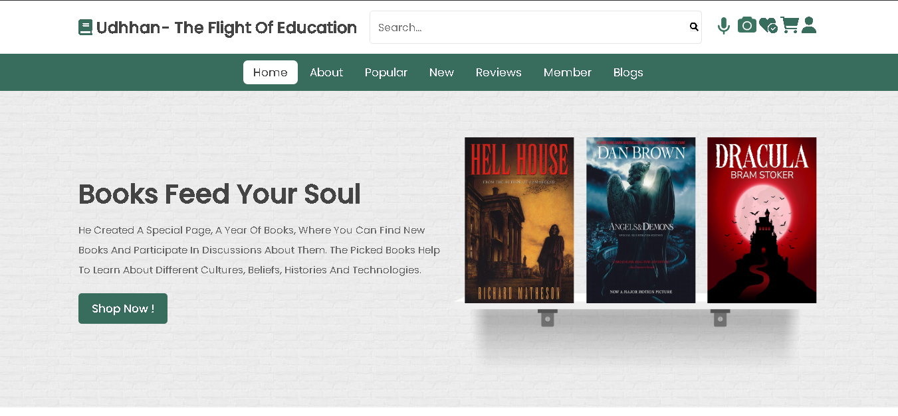

# 🌱 Udhhan – The Flight of Education 📚✈️

**Udhhan** is a modern and intelligent e-bookstore platform built with a focus on accessibility, technology, and educational empowerment. It supports multimodal book discovery — via text, voice, and images — and offers full shopping cart and order tracking functionality.

> **"Udhhan – The Flight of Education"**  
> Fueling minds through innovation and seamless digital access to books.

---

## 🌟 Features

### 🔍 Smart Book Search
- **Text Search** using the **Google Books API**
- **Voice Search** via **Web Speech API**
- **Image-to-Text Search** using the **OCR.Space API**

### 👤 User Features
- Secure **user authentication** with registration, login, and password reset
- Profile management and order history
- Session-based **shopping cart and checkout**

### 🛒 E-Commerce System
- View and manage cart
- Place orders with total calculation
- View past orders with item breakdown

### 🎨 UI/UX & Frontend
- Responsive layout with **Swiper.js** for dynamic carousels
- Error handling with **custom 404 page**
- Mobile-optimized design with smooth transitions

---

## 🧩 Tech Stack

| Layer         | Technology                     |
|--------------|---------------------------------|
| Frontend     | HTML5, CSS3, JavaScript         |
| UI Framework | Swiper.js                       |
| Backend      | PHP                             |
| OCR          | OCR.Space API                   |
| Voice Search | Web Speech API                  |
| Book Data    | Google Books API                |
| Local Server | Apache via XAMPP / MAMP / WAMP |
| Database     | MySQL                           |

---

## 📂 Project Structure

```bash
Udhhan/
├── index.php                # Home page
├── login.php 
├── cart.php
├── order_history.php
├── forgot_password.php 
├── process_order.php
├── book_preview.html
├── js/                     # JavaScript logic
├── css/                    # Styles
├── img/                    # Static images
├── uploads/                # OCR upload temp
├── book_covers/            # Cover images
├── assets/                 # UI Screenshots
│   ├── home.png
│   ├── home-2.png
│   ├── home-3.png
│   └── search.png
└── README.md
```

---

## ⚙️ Local Setup Instructions

### ✅ Requirements

- [XAMPP](https://www.apachefriends.org/) / [MAMP](https://www.mamp.info/) or any **Apache-compatible local server**
- **MySQL**
- PHP (7.4+)

### 🏗️ Steps to Run Locally

1. **Clone the Repository**
   ```bash
   git clone https://github.com/mrNarayan07/Udhhan-EBookStore.git
   cd Udhhan-EBookStore
   ```

2. **Move the Project Folder**
   Move the project to your Apache server directory:
   - For XAMPP: `C:/xampp/htdocs/Udhhan-EBookStore`
   - For MAMP: `/Applications/MAMP/htdocs/Udhhan-EBookStore`

3. **Start Apache & MySQL** via Control Panel

4. **Create the Database**
   Open **phpMyAdmin** and execute the following SQL:

   ### 📂 Database: `udhhan`

   ```sql
   CREATE DATABASE udhhan;
   USE udhhan;

   -- Table: users
   CREATE TABLE `users` (
     `user_id` int(11) UNSIGNED NOT NULL AUTO_INCREMENT,
     `name` varchar(255) NOT NULL,
     `email` varchar(255) NOT NULL,
     `password` text NOT NULL,
     `security_question` varchar(255),
     `security_answer` varchar(255),
     `logs` text,
     `created_at` timestamp NOT NULL DEFAULT current_timestamp(),
     `updated_at` timestamp NOT NULL DEFAULT current_timestamp() ON UPDATE current_timestamp(),
     `profile_picture` varchar(255),
     `last_login` timestamp NOT NULL DEFAULT current_timestamp() ON UPDATE current_timestamp(),
     `is_active` tinyint(1) DEFAULT 1,
     `role` varchar(50) DEFAULT 'user',
     `reset_token` varchar(255),
     `reset_token_expiry` datetime,
     PRIMARY KEY (`user_id`),
     UNIQUE KEY `email` (`email`)
   ) ENGINE=InnoDB DEFAULT CHARSET=utf8mb4;

   -- Table: orders
   CREATE TABLE `orders` (
     `order_id` int(11) NOT NULL AUTO_INCREMENT,
     `user_id` int(11) NOT NULL,
     `item_ids` text NOT NULL,
     `total_amount` decimal(10,2) NOT NULL,
     `payment_method` varchar(50) NOT NULL,
     `order_date` datetime NOT NULL,
     PRIMARY KEY (`order_id`)
   ) ENGINE=InnoDB DEFAULT CHARSET=utf8mb4;
   ```

5. **Run the App**
   Open your browser and navigate to:
   ```
   http://localhost/Udhhan-EBookStore/
   ```

---

## 📸 Screenshots

### 🏠 Home Page  

!(assets/home-2.png)  
!(assets/home-3.png)

### 🔍 Search Interface  


---

## ✅ Completed Features

- ✅ Google Books integration
- ✅ OCR-based book search
- ✅ Voice recognition search
- ✅ Cart & checkout system
- ✅ User registration/login/forgot/reset
- ✅ Order history with tracking
- ✅ Swiper.js carousels
- ✅ Responsive UI and error handling

---

## 🧠 Future Roadmap

- 💳 Payment gateway (e.g., Razorpay, Stripe)
- 📲 Progressive Web App (PWA) version
- 🔎 Filter/search by genre, author, price
- 🧠 Recommendation engine
- 🌐 Localization (multi-language)
- 🧾 Admin dashboard for book/inventory management

---

## 🤝 Contributing

We welcome improvements and ideas!

```bash
# Fork the repository
# Create a new branch
git checkout -b feature/your-feature

# Push your changes
git commit -m "Add feature"
git push origin feature/your-feature
```

Then open a **Pull Request** on GitHub.

---

## 🧑‍💻 Credits

**Project Name**: Udhhan  
**Slogan**: *"The Flight of Education"*  


---
